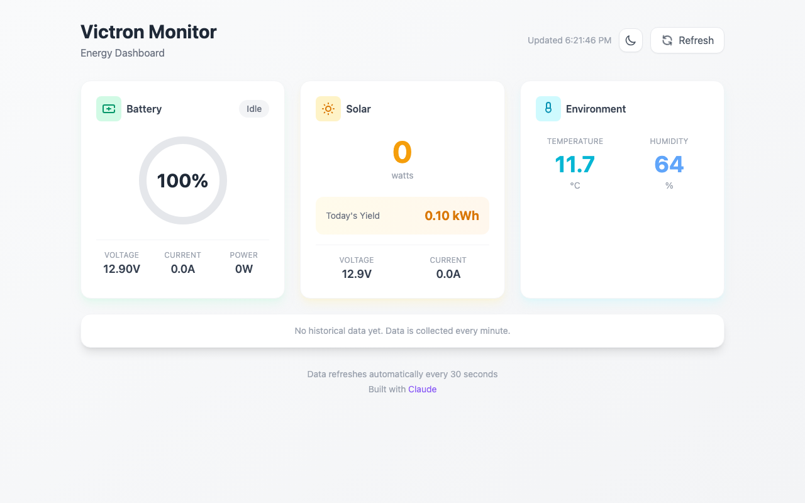
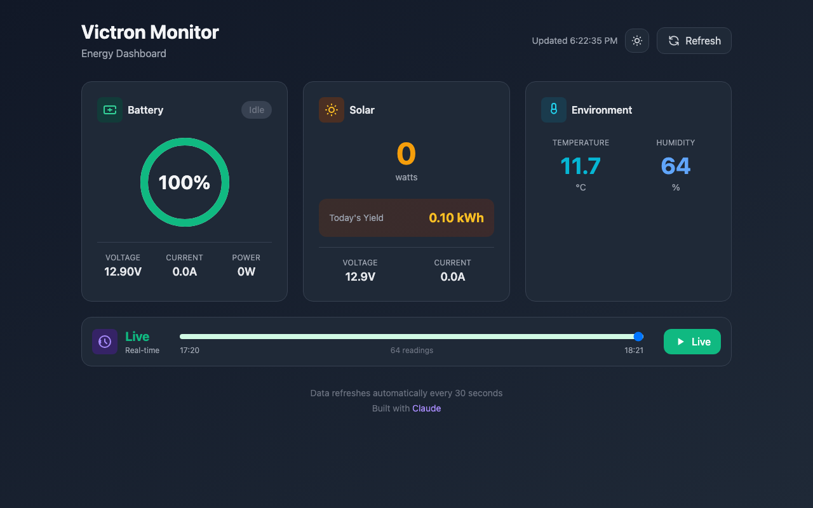

# Victron Monitor

[](https://github.com/dc-morris/victron-monitor/actions/workflows/ci.yml)
[](https://opensource.org/licenses/MIT)
[](https://claude.ai)

A simple energy monitoring dashboard for Victron systems using the VRM API.

**Live Demo:** [victron-monitor.fly.dev](https://victron-monitor.fly.dev/)

<p align="center">
  
  
</p>

## Features

- **Battery monitoring** - Voltage, current, power, and estimated SOC (state of charge) from voltage
- **Solar tracking** - Real-time power output and daily yield
- **Environment sensors** - Temperature and humidity from connected sensors (e.g., Ruuvi)
- **Time travel** - Scroll through 24 hours of historical data and watch the dashboard update
- **Auto-refresh** - Dashboard updates every 30 seconds
- **Data logging** - Historical data stored locally in SQLite
- **Modern UI** - Clean, responsive design with circular gauges and color-coded status
- **Dark mode** - Toggle between light and dark themes, respects system preference

## Requirements

- [Fly.io](https://fly.io) account (free tier works)
- Victron VRM account with API access
- A Victron device connected to VRM (e.g., GlobalLink 520, Cerbo GX)

## Deployment

1. Clone the repository:
   ```bash
   git clone https://github.com/dc-morris/victron-monitor.git
   cd victron-monitor
   ```

2. Install the Fly CLI and authenticate:
   ```bash
   curl -L https://fly.io/install.sh | sh
   fly auth login
   ```

3. Create the apps (update app names in `fly.toml` files if needed):
   ```bash
   cd backend && fly launch --no-deploy
   cd ../frontend && fly launch --no-deploy
   ```

4. Create a persistent volume for the database:
   ```bash
   cd backend && fly volumes create victron_data --region lhr --size 1
   ```

5. Set your VRM credentials:
   ```bash
   cd backend
   fly secrets set VRM_TOKEN=your_vrm_access_token
   fly secrets set VRM_INSTALLATION_ID=your_site_id
   ```

   **To get these values:**
   - **VRM Token**: Go to [VRM Access Tokens](https://vrm.victronenergy.com/access-tokens) and create a new token
   - **Installation ID**: Found in your VRM URL: `vrm.victronenergy.com/installation/XXXXX/dashboard`

6. Deploy:
   ```bash
   cd backend && fly deploy
   cd ../frontend && fly deploy
   ```

## Tech Stack

- **Backend**: Python, FastAPI, SQLAlchemy, SQLite
- **Frontend**: React, Tailwind CSS
- **Deployment**: Fly.io

## Battery SOC Estimation

Since not all Victron setups include a battery monitor (BMV), SOC is estimated from voltage using a lookup table for 12V lead-acid/AGM batteries. This is approximate and works best when the battery is at rest.

## API Endpoints

- `GET /api/current` - Latest readings
- `GET /api/history?hours=24` - Historical data
- `GET /api/stats` - Today's statistics
- `POST /api/refresh` - Trigger manual data refresh
- `GET /api/health` - Health check

## License

MIT
